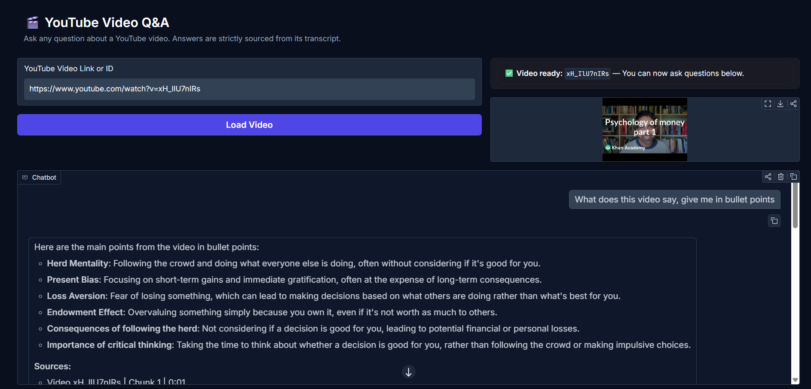
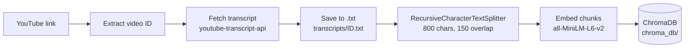
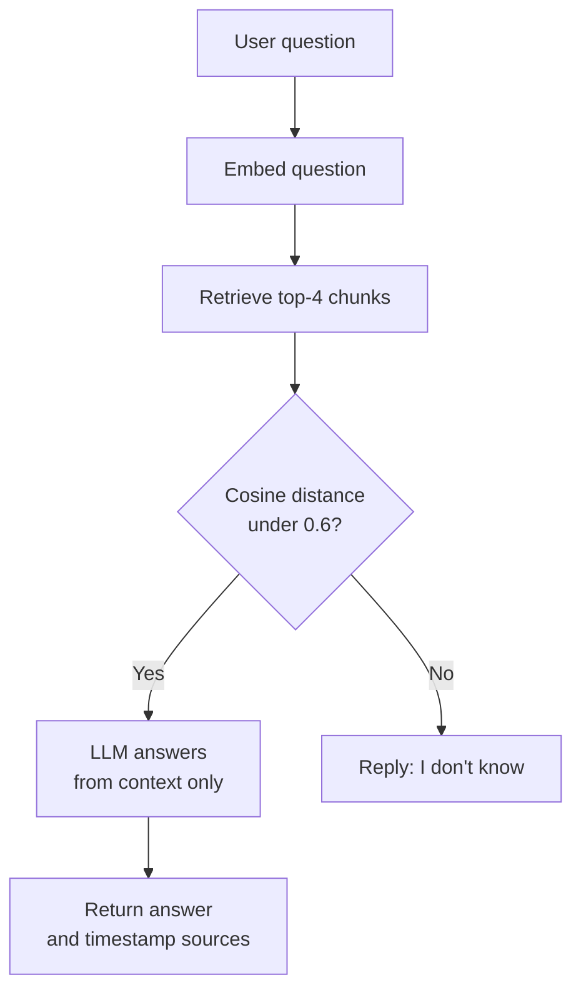
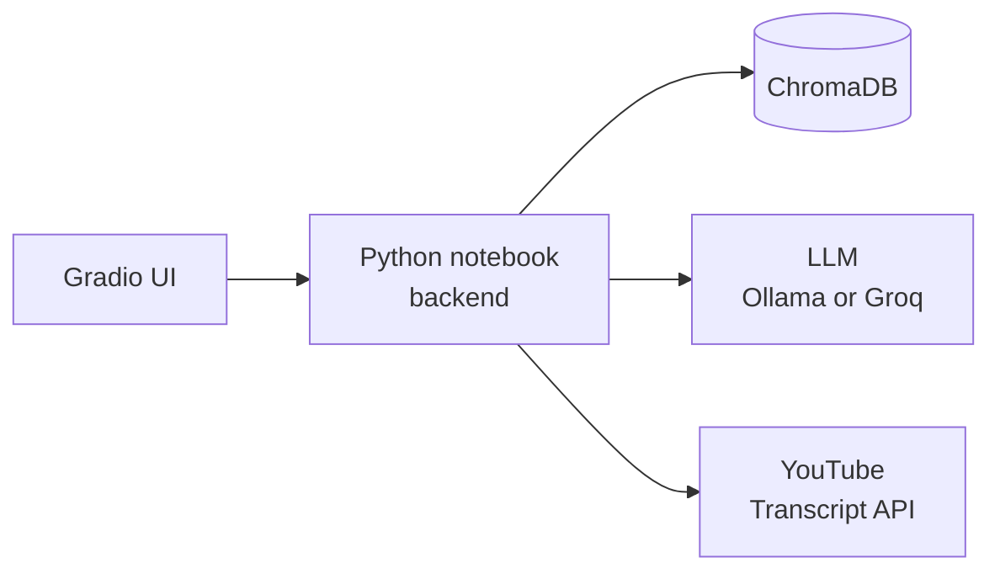

# 🎬 YouTube Video Q&A

> Ask questions about any YouTube video — answers come **only** from its transcript, never from the model's memory.


---

## Overview

YouTube Video Q&A is a **RAG** (Retrieval-Augmented Generation) chatbot that turns any YouTube video into a searchable knowledge base. Paste a video link, and you can immediately ask questions about it.

The app fetches the video's captions, splits them into overlapping text chunks, converts each chunk into a vector embedding (a number-array that captures meaning), stores those embeddings in a local vector database, and retrieves the most relevant chunks when you ask a question. A large language model then synthesises an answer **strictly** from those chunks. If your question has no answer in the transcript, the bot replies `"I don't know"` instead of hallucinating.

Every answer includes **clickable timestamp links** that jump you to the exact moment in the video.

---

## Demo



**Example conversation**

| Turn | Message |
|------|---------|
| You | *"How do insurance companies make money?"* |
| Bot | Insurance companies collect premiums, evaluate risk, and invest the pooled money in other financial products… **Sources:** [Video qjXgpJpSlCc \| Chunk 1 \| 0:00](https://www.youtube.com/watch?v=qjXgpJpSlCc&t=0s) |
| You | *"Who won the 2022 FIFA World Cup?"* |
| Bot | I don't know |

---

## Key Features

**Required (assignment brief)**
- Fetches transcripts from YouTube using video IDs and saves them as `.txt` files
- Splits transcripts into 800-character chunks with 150-character overlap
- Embeds chunks with `all-MiniLM-L6-v2` and stores them in ChromaDB
- Answers questions strictly from retrieved context
- Returns `"I don't know"` for out-of-context questions
- Terminal chat loop (`exit` to stop) and Gradio web UI
- Sources shown with chunk number and timestamp for every answer

**Extra (beyond the brief)**
- Smart URL parser — accepts `watch?v=`, `youtu.be/`, `/shorts/`, `/embed/`, or bare IDs
- Dual LLM backend — local Ollama (`llama3.2`) or cloud Groq (`llama-3.3-70b-versatile`), switchable with one config line
- Timestamped deep-links — each source chunk links directly to `youtube.com/watch?v=ID&t=Ns`
- Meta-question handling — summary/overview questions bypass the distance filter so the bot can synthesise across all chunks
- Ingestion deduplication — videos already in ChromaDB are skipped automatically
- Custom dark Gradio theme — Inter/JetBrains Mono fonts, indigo accent, dark slate palette
- Video thumbnail preview — loads the YouTube thumbnail when a video is loaded in the UI
- Status indicator — green pill shows which video is currently active
- Retry loop on bad URL — invalid URLs prompt the user to try again instead of crashing

---

## How It Works

### Ingestion pipeline

The diagram below shows how a YouTube link becomes a searchable vector store.



### Question-answering flow

This diagram shows what happens every time you send a message.



### Component overview



**Step-by-step walkthrough**

1. **Paste a link** — any YouTube URL format or bare video ID is accepted.
2. **Fetch transcript** — captions are downloaded in English; falls back to any available English variant automatically.
3. **Save to disk** — each line saved as `[seconds] text` in `transcripts/<ID>.txt`.
4. **Chunk** — text is split into 800-character chunks with 150-character overlap so sentences are not cut mid-thought.
5. **Embed** — `all-MiniLM-L6-v2` converts each chunk to a 384-dimension L2-normalised vector.
6. **Store** — chunks, embeddings, and metadata (`video_id`, `chunk_number`, `start_seconds`) are upserted into ChromaDB (cosine similarity space).
7. **Ask** — your question is embedded and the top 4 closest chunks are retrieved.
8. **Filter** — chunks with cosine distance > 0.6 are discarded. If nothing passes, `"I don't know"` is returned immediately without calling the LLM.
9. **Generate** — the LLM receives a strict system prompt plus the surviving context blocks and must answer from them only.
10. **Cite** — sources render as `[Video ID | Chunk N | M:SS](youtube_link)` markdown links.

---

## Tech Stack

| Component | Tool | Why |
|-----------|------|-----|
| Transcript fetching | `youtube-transcript-api` | No API key needed; handles auto-generated captions |
| Text splitting | `langchain-text-splitters` `RecursiveCharacterTextSplitter` | Respects sentence boundaries; configurable overlap |
| Embedding model | `sentence-transformers` `all-MiniLM-L6-v2` | Fast, 22 MB, strong English semantic quality, CPU-only |
| Vector database | `chromadb` PersistentClient, cosine space | Zero-config local persistence; no server needed |
| LLM (local) | `ollama` `llama3.2` | Free, offline, deterministic at temperature 0 |
| LLM (cloud) | `groq` `llama-3.3-70b-versatile` | Free tier, fast inference, Ollama fallback |
| UI | `gradio` Blocks + ChatInterface | Rapid prototyping, built-in chat history |
| Language | Python 3.12 | — |

---

## Project Structure

```
RAG_GenAI_app/
├── youtube_rag_chatbot.ipynb   # Complete executable notebook (Sections 0–9)
├── transcripts/                # Downloaded transcript .txt files (auto-created)
│   └── <video_id>.txt          # One file per video: "[seconds] text" per line
├── chroma_db/                  # Persistent ChromaDB vector store (auto-created)
└── Readme.md                   # This file
```

---

## Getting Started

### Prerequisites

| Requirement | Notes |
|-------------|-------|
| Python 3.10+ | Tested on 3.12 |
| Jupyter Notebook or JupyterLab | `pip install notebook` |
| Ollama (recommended) | [ollama.com](https://ollama.com) — install then pull the model |
| Groq API key (optional) | [consolegroq.com](https://console.groq.com) — free tier available |

### Installation

```bash
# 1. Clone the repo
git clone https://github.com/Sarthak-Salunke/youtube-video-qa-rag.git
cd youtube-video-qa-rag

# 2. Install dependencies
pip install youtube-transcript-api langchain-text-splitters sentence-transformers chromadb ollama groq gradio

# 3. Pull the local LLM (skip if using Groq)
ollama pull llama3.2
```

### Configuration

```bash
# .env.example — copy to .env and fill in your key
GROQ_API_KEY=your_groq_api_key_here   # only needed when LLM_PROVIDER = "groq"
```

Set the variable before launching Jupyter:

```powershell
# Windows PowerShell
$env:GROQ_API_KEY = "your_key_here"
jupyter notebook
```

```bash
# macOS / Linux
export GROQ_API_KEY="your_key_here"
jupyter notebook
```

All other settings (chunk size, model names, distance threshold) live in **Section 1** of the notebook.

### Running the notebook

Open `youtube_rag_chatbot.ipynb` in Jupyter, then:

```
Kernel → Restart & Run All Cells
```

- **Sections 0–6** install deps and define all functions.
- **Section 7** calibrates and tests the retrieval threshold.
- **Section 8** starts the terminal chat loop — type `exit` when done.
- **Section 9** launches the Gradio UI.

---

## Usage

1. Run all cells (see above).
2. **Terminal loop (Section 8)** — paste a YouTube URL when prompted, or press Enter for the default video. Ask questions, type `exit` to stop.
3. **Gradio UI (Section 9)**:
   - Paste a YouTube link into the **"YouTube Video Link or ID"** box and click **Load Video**.
   - A green pill confirms the video is ready; a thumbnail appears on the right.
   - Type your question in the chat box and press Enter.
   - Answers appear with formatted sources below them.

---

## Design Decisions

- **Chunk size 800 / overlap 150** — large enough to hold a complete thought (~2–3 sentences), small enough for precise retrieval. Overlap prevents key sentences being cut across two chunks.
- **`all-MiniLM-L6-v2`** — 384-dim, ~22 MB, runs on CPU in under 1 second per batch. No GPU required.
- **Cosine distance threshold 0.6** — empirically calibrated on the default video: in-context questions score 0.28–0.38, out-of-context questions score 0.93–1.03. The gap is large; 0.6 sits safely between them.
- **Dual "I don't know" fallback** — (1) the distance filter rejects irrelevant chunks before the LLM sees them; (2) the system prompt instructs the LLM to reply exactly `"I don't know"` if context is insufficient. Both checks run independently.
- **Timestamp tracking** — transcript lines are saved with their start time in seconds. A binary search (`bisect.bisect_right`) maps each chunk's character offset back to the nearest transcript line, giving timestamps precise to within one caption segment.
- **Meta-question bypass** — questions containing words like "summary", "about", or "overview" skip the distance filter so the LLM can synthesise an answer across all retrieved chunks.

---

## Limitations & Known Issues

- **English captions only** — requests `en`, `en-US`, `en-GB`, `en-CA`, `en-AU`; falls back to any English variant. Non-English videos are skipped.
- **Captions must be available** — videos with captions disabled are reported and skipped gracefully.
- **Groq free-tier rate limits** — ~30 requests/minute. Switch to `LLM_PROVIDER = "ollama"` for unlimited local use.
- **No chat memory** — each question is answered independently; the bot does not remember earlier turns.
- **Ollama must be running** — start with `ollama serve` before launching the notebook.

---

## Future Improvements

1. **Multi-video queries** — ask one question across several loaded videos at once.
2. **Conversation memory** — pass the last N turns as context so follow-up questions work naturally.
3. **Streaming responses** — yield tokens incrementally in Gradio for faster perceived speed.
4. **HuggingFace / OpenAI LLM support** — add a third provider branch in `ask_llm`.
5. **Export chat** — download the Q&A session as a PDF or markdown file.
6. **Non-English videos** — detect caption language automatically and translate before chunking.

---

## Troubleshooting

| Error / Symptom | Likely cause | Fix |
|----------------|-------------|-----|
| `TranscriptsDisabled` or `NoTranscriptFound` | Video has no captions | Try a video with CC/auto-captions enabled |
| `ConnectionRefusedError` from Ollama | Ollama service not running | Run `ollama serve` in a terminal |
| `GROQ_API_KEY is not set` | Environment variable missing | Export `GROQ_API_KEY` before launching Jupyter |
| Gradio port already in use | Previous session still active | Run `demo.close()` in a new cell, then re-run Section 9 |
| `NameError: answer_question` | Section 6 not executed | Restart kernel and Run All Cells |
| Bot always says "I don't know" | `MAX_DISTANCE` too low | Run Section 7, check in-context distances, raise the threshold |

---

## Acknowledgements

- [youtube-transcript-api](https://github.com/jdepoix/youtube-transcript-api) by Jonas Depoix
- [LangChain Text Splitters](https://github.com/langchain-ai/langchain)
- [Sentence Transformers](https://www.sbert.net/) — `all-MiniLM-L6-v2`
- [ChromaDB](https://www.trychroma.com/)
- [Ollama](https://ollama.com) · [Groq](https://groq.com)
- [Gradio](https://gradio.app)

---

## License

MIT — see `LICENSE` for details.
<!-- TODO: add a LICENSE file to the repo -->

## Author

<!-- TODO: Replace with your name, GitHub profile, and institution -->
**Sarthak Salunke** · [GitHub](https://github.com/Sarthak-Salunke)
